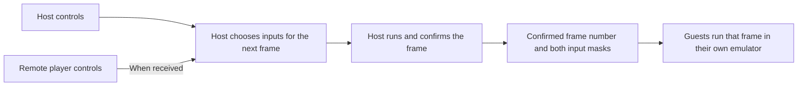

The host should play without waiting for another browser. Guests follow the host's game and recover their own connection without stopping ordinary host play.

Audience: Human

# Immediate host input

## Requested behavior

- When the host plays P1, apply their current controls to the next emulator frame, without an intentional input buffer or a guest acknowledgement.
- Guests may display an earlier frame. The same confirmed frame must produce the same game state in every browser.
- A slow, disconnected or recovering guest must not pause ordinary host play. Remote controls become neutral when their connection is lost or stale.
- Keep the existing journey: find or host a lobby → load NES → Prepare → host Start → play. Use the existing lobby, controls, chat and recovery feedback; do not ask players to choose a networking mode.

This removes **added network delay** for the host. Keyboard polling, emulator work, screen refresh and the host's own machine still take time. A remote player still has network delay. The same local-input rule applies if the host occupies another supported controller position; P1 alone does not confer authority on a guest.

## How play works

The network carries controller inputs and occasional recovery checkpoints. Every browser draws its own game; this is not picture streaming. The host never revises a completed frame because a guest's input arrived late.

## Journeys and recovery

| Journey | Actions and observable result | Recovery and completion |
|---|---|---|
| Host and P2 play | From the public site, host/join a lobby, load the same NES, Prepare, then Start. Host presses a control: the next eligible native frame uses it. P2 presses a control: the host uses it after receipt, and everyone replays that confirmed result. | Start still requires the existing required controllers to be prepared. Complete when both control the actual game and identical completed frames have matching state hashes. |
| A guest falls behind | During play, slow or interrupt P2 or a spectator. Host and other healthy guests continue. The affected guest sees connection/synchronization feedback in the current game area. | Release stale remote controls, keep the member's slot under existing membership rules, and synchronize that browser from retained frames or a fresh checkpoint. Complete when it follows current play and its controls work again, without restarting the host's cartridge. |
| A guest refreshes or joins during play | Use the existing rejoin/invite path. The member loads the matching NES and synchronizes while the host continues. | Do not accept that member's controls until its current membership, controller assignment and synchronization are valid. Failure leaves an actionable reason and the existing retry route. Complete when the member can watch or use its assigned controller. |
| Players change shared state | Use the existing Pause, Load, Restart, Change game or slot actions. These deliberate operations retain their existing authority and coordinated completed-frame boundary. | If a required participant cannot finish the transaction, keep or restore the authoritative prior state and show the existing retry/recovery path. Do not turn an ordinary late packet into such a transaction. Complete when the operation succeeds for the required machines or leaves a consistent recoverable game. |

Losing the host remains different: the authority is unavailable, so use the existing host recovery/closure rules. Host migration is outside this request.

## Acceptance

1. No remote input, acknowledgement, hash response or transport buffer gates the host's next ordinary frame.
2. A host press/release affects the next eligible native frame, including while P2 sends nothing. Visual button highlighting alone is insufficient proof.
3. Confirmed frame numbers advance in order; guests never invent missing frames. A time offset is expected; a different state at the same frame is an error requiring recovery.
4. A disconnected controller cannot leave a button held indefinitely or regain control through an old packet.
5. Save/Load, Restart, game replacement, role changes, mid-game joining, chat, voice and browser refresh retain their existing success and recovery behavior.
6. No added page, player-facing latency setting, network-mode selector or duplicated recovery control.

## Scope and rationale

Keep browser-local emulation, the existing OSS cores, automatic direct/relay routing and host ownership. Prediction, rollback of ordinary play, video streaming and a new server emulator are outside this delivery.

[Blizzard's StarCraft explanation](https://us.forums.blizzard.com/en/starcraft/t/turn-rates-matchmaking-and-you/519) describes waiting for agreed turns and adapting turn rate to latency. That model would still make the host wait. We adopt measured guest pacing while preserving each NES game's native frame rate.

The [technical plan](../implementation/host-immediate-input.md) defines protocol, ownership, recovery and verification. This is planned behavior, not a claim about the released game.
